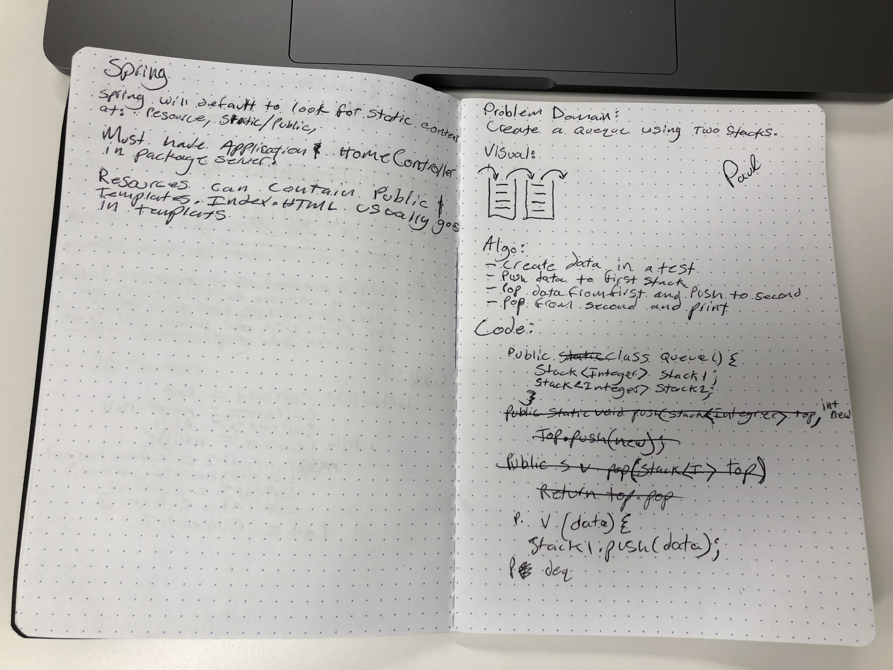

# Implement a Queue using two Stacks.
<!-- Short summary or background information -->
### Problem domain: Create a queue using two stacks

## Challenge
<!-- Description of the challenge -->
### Populate a stack. Pop of stack and push to new stack. Pop off new stack.

## Solution
<!-- Embedded whiteboard image -->
### Create data in a test
### push data to first stack
### pop data from first and push to second
### pop from second and print

