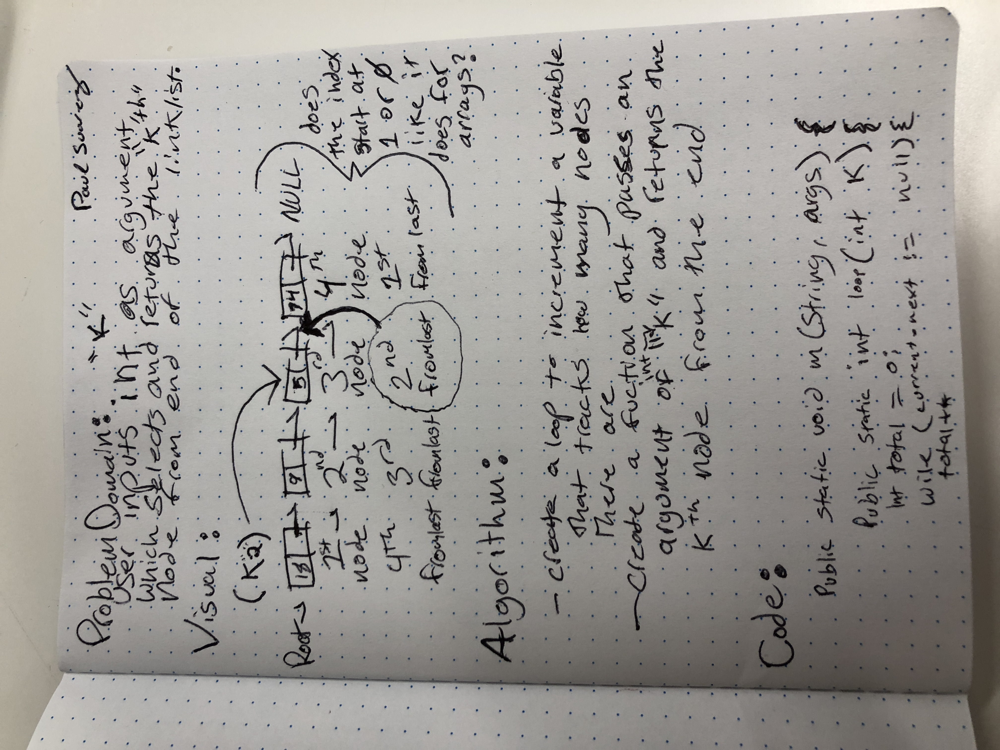

# kth from the end of a Linked List
<!-- Short summary or background information -->
### Problem Domain:
### User inputs int k as argument, which selects and returns the "kth" node from the end of the linkedlist.
​
## Challenge
<!-- Description of the challenge -->
### finding a way to grab a node that is a specific number of nodes in from the end of the linkedlist.
​
## Solution
<!-- Embedded whiteboard image -->
### Create a loop to increment a variable that tracks how man nodes there are.
### Create a function that passes an argument of int "k" and returns the kth node from the end of the linkedlist.

