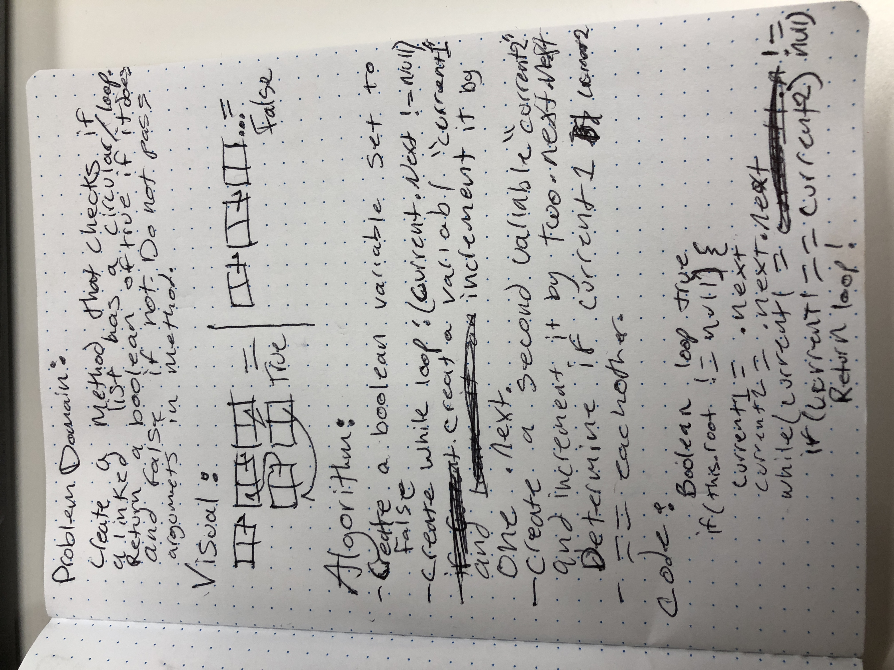

# Identify a Circular Reference
<!-- Short summary or background information -->
###Create a method that checks if a lonked list jhas a circular/loop.
## Challenge
<!-- Description of the challenge -->
###Return a boolean of true if it does and false if not.
## Solution
<!-- Embedded whiteboard image -->
###Create a boolean variable set to true. 
###Create a while loop (current.next != null).
###Create variables current and current2. 
###Advance 1 by .next and 2 by .next.next.
