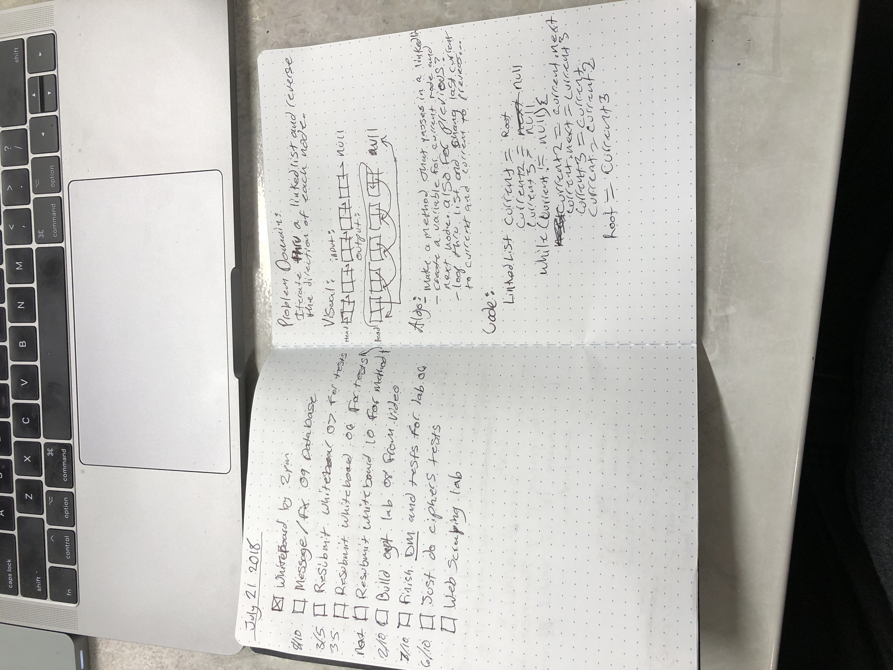

# Reverse LinkedList
<!-- Short summary or background information -->
###Create a method that reverses LinkedList
## Iterate through a linkedlist and reverse the direction of each node.
<!-- Description of the challenge -->
###Return a reversed list from the method.
## Solution
<!-- Embedded whiteboard image -->
### Make a method that passes a linkedlist 
### created 3 variables, each tracking current next and previous.
### loop through list and change lass to current and current to previous. 

