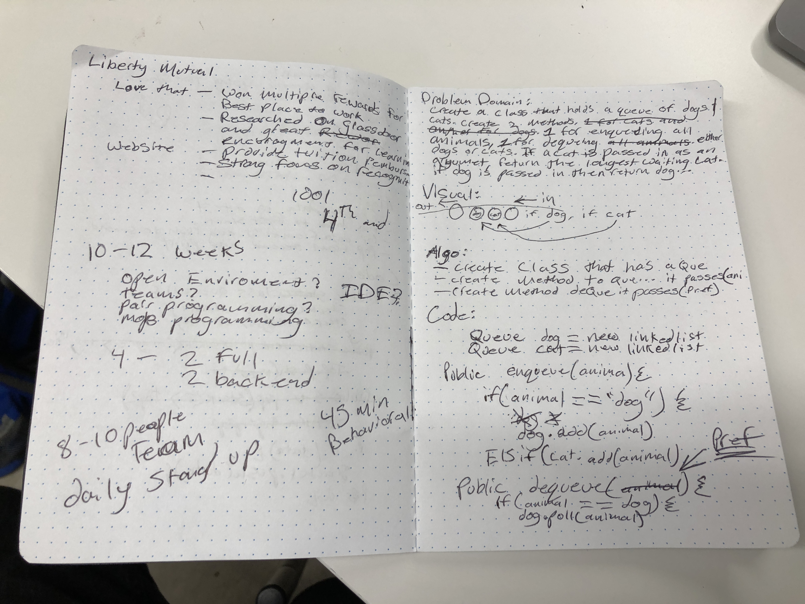

# First-in, First out Animal Shelter.
<!-- Short summary or background information -->
### Problem Domain: Create a class that holds a queue of dogs and cats. Create two methods, 1 for enqueing all animals, and one for dequeueing either animal that's passed in as an argument.

## Challenge
<!-- Description of the challenge -->
### Add cats or dogs to the queue. Pull the most recent item from the queue.

## Solution
<!-- Embedded whiteboard image -->
## Create class that has the queues. Create methods to queue and dequeueu... that passes (animal and pref per instruction).

