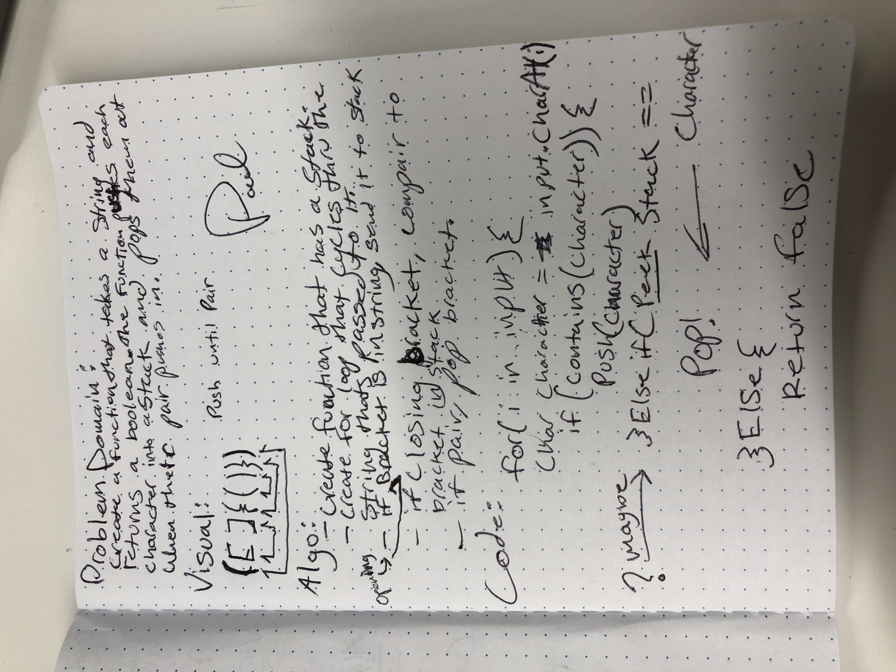

# Multi-bracket Validation.
<!-- Short summary or background information -->
### Problem Domain:
#### Create a function that takes a string and returns a boolean. The function pushes each character into a stack and pops them out when their pair pushes in.

## Challenge
<!-- Description of the challenge -->
### Compairing chars with chars in a stack.

## Solution
<!-- Embedded whiteboard image -->
### - create function that has a stack - create for loop that cycles thru the string thats passed to it, - If bracket is in string, send it to slack. - If closing bracket, compair to bracket in stack. - If pair, pop bracket.

