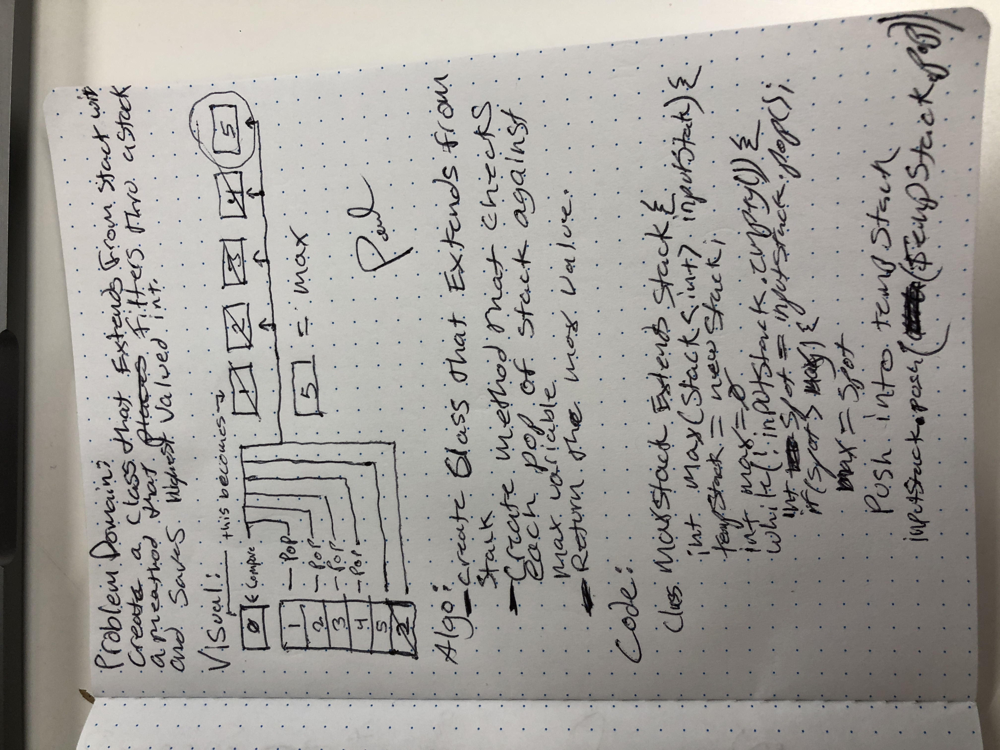

# maxstack
<!-- Short summary or background information -->
### Problem Domain:
#### Create a class that extends from stack with a method that filters thru a stack and saves highest value.
## Challenge
<!-- Description of the challenge -->
### idetify the largest valued int in a stack.

## Solution
<!-- Embedded whiteboard image -->
### - create class that extends from stack - Create a method that checks each pop of stack against - return the max value.

