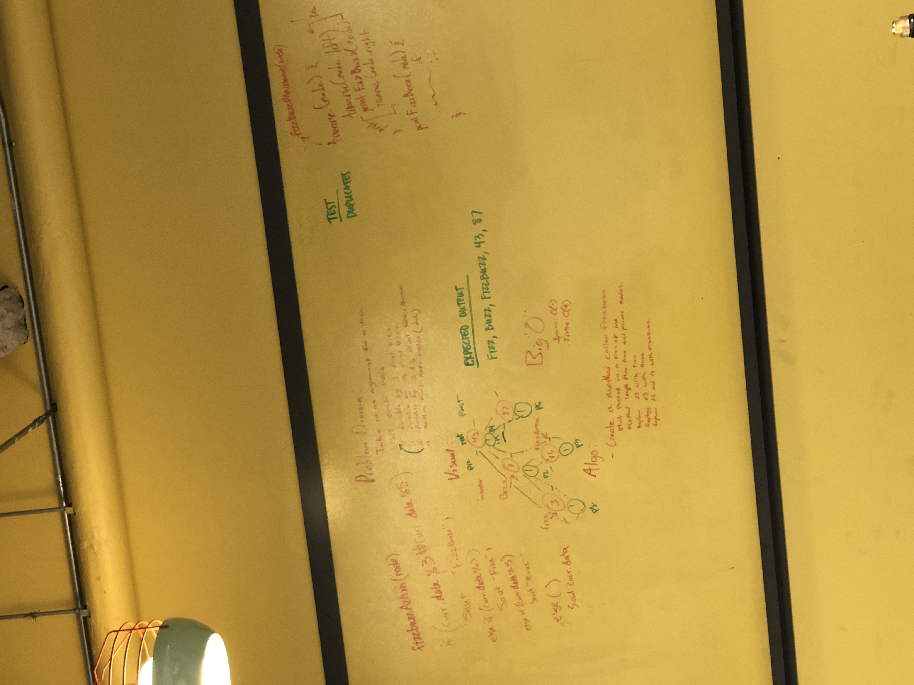

# FizzBuzz Tree
<!-- Short summary or background information -->
### pass a node into a method that checks if it is fizz, buzz, or fizzbuzz.

## Challenge
<!-- Description of the challenge -->

## Solution
<!-- Embedded whiteboard image -->
### Create a method. Pass a node into it and run it through if statements too see if the value of the node is divisible by 3, 5 or both.

