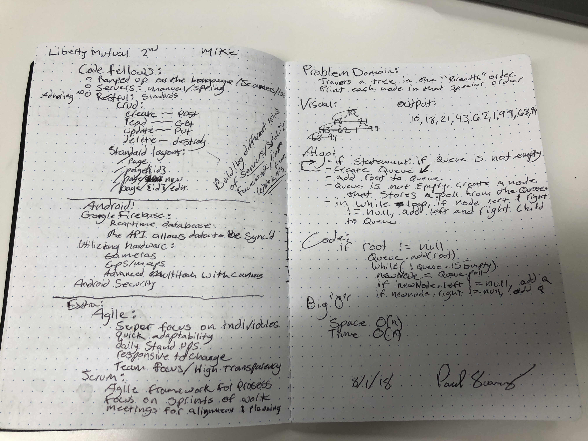

# Breadth-first
<!-- Short summary or background information -->
## Problem Domain:
### Travers a tree un the "breadth" order. Print each node in that special order.

## Challenge
<!-- Description of the challenge -->

## Solution
<!-- Embedded whiteboard image -->
### If statement: create a queue. if queue is not empty, add root to queue. queue is not empty, create node that stores a .poll from the queue. In while loop, if node left and right are not null, add lef and right children nodes to the queue.

