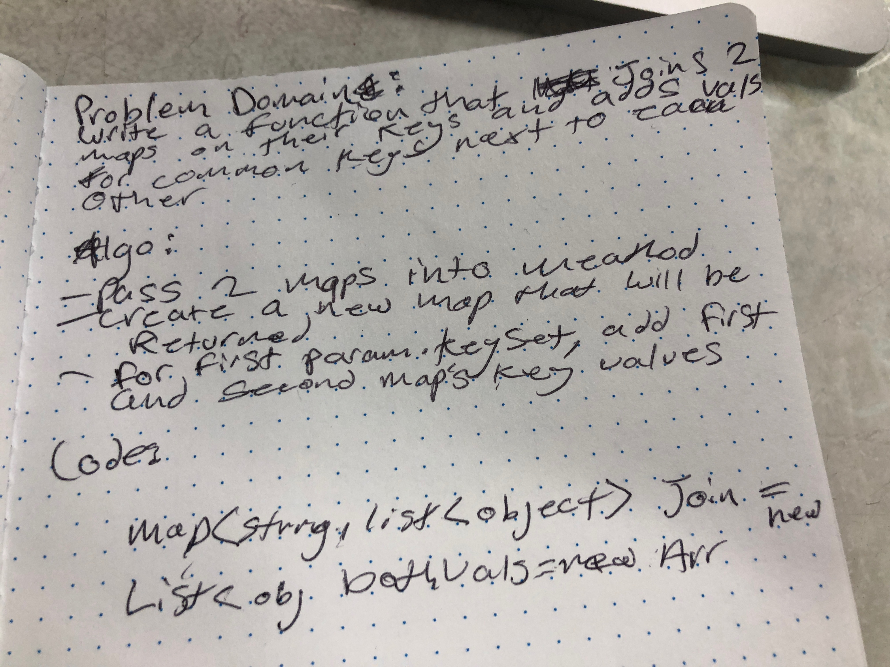

# Hashmap LEFT JOIN
<!-- Short summary or background information -->
## Problem Domain
### Write a function that joins 2 maps on their key and adds vals for common keys next to each other

## Challenge
<!-- Description of the challenge -->
### pass 2 maps into meathod, create a new map that will be return, for first param.keyset, add first and second maps key values.

## Solution
<!-- Embedded whiteboard image -->

